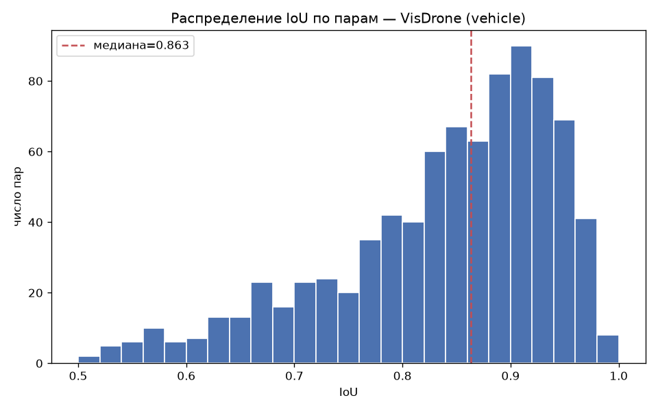
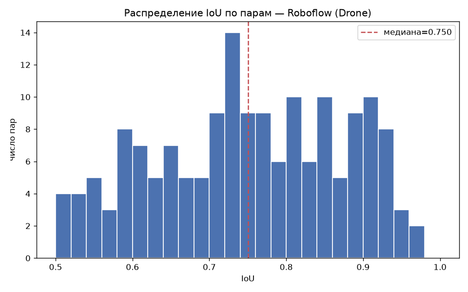

# IoU gold set vs GT — final annotation-agreement report

**Date:** 2026-08-03

## Header

**What this is.** The final report on the agreement of the manual (blind) gold-set annotation with the source annotation for VisDrone (`vehicle`) and Roboflow (`Drone`). Below, the source annotation is denoted GT (ground truth). The report's subject is the agreement of the two annotations with each other. The agreement metric is IoU (intersection over union, a metric for the overlap of two boxes).

I obtained the numeric results by computing over the entire gold set. The conclusions about the nature of the divergences rest on visual review in FiftyOne. I drew some conclusions by spot-checking individual frames, without a systematic pass over the set; the list of such conclusions is in section 11.

References to samples and labels are given through stable anchors: the manifest `sample_id` (SHA-256) plus `gold_filename`, and for labels additionally the side and coordinates (`sample_id | side | x0,y0,x1,y1`). FiftyOne session IDs are unstable, so they are not used.

## 1. Methodology

1. **Export.** I exported the gold-set annotation from CVAT (Computer Vision Annotation Tool) in COCO 1.0 format (`gold_set/annotations/`). The annotation was done as separate tasks per class: VisDrone `vehicle` and Roboflow `Drone`.
2. **Coordinate verification (Step 0).** For all 179 gold-set frames, I checked the width and height from the CVAT export against the original dimensions from `manifest.parquet`. The frame `gold_0173.jpg` is excluded — it is empty in CVAT. There are no divergences (0 of 179), so gold and GT coordinates are directly comparable, without recomputation.
3. **Exclusions (Step 1),** applied to matching:
   - **VisDrone `ignore_regions` zones.** A box (gold or GT) is excluded if more than 50% of its area falls into the union of the frame's `ignore_regions` zones. The 50% threshold sets the boundary between two cases: "the object falls into an ignored zone" (exclude entirely) and "the zone touches the object at the edge" (keep in matching without partial exclusion). At more than half the area overlapping, the box is considered to belong to the ignored zone.
   - **VisDrone class `others`.** This is a class of the original VisDrone taxonomy that groups objects not assigned to any of the named categories (1,829 objects on the active rows, see [class_distribution-en.md](class_distribution-en.md)). GT `others` boxes participate in matching only for neutralization: if a gold box's best geometric pair is an `others` box, the pair counts neither as a hit nor as an excess box. Rationale: the category has no defined content, so matching against it is not informative.
   - **VisDrone non-target GT classes** (pedestrians, people, bicycle, motor, tricycle, awning_tricycle) do not participate in matching at all.
4. **Matching (Step 2).** The Hungarian algorithm (`scipy.optimize.linear_sum_assignment`), separately for each frame rather than globally over the whole dataset. Cost = 1 − IoU. The matching threshold is IoU ≥ 0.5; otherwise the pair is considered unmatched, and both boxes go to the unpaired ones. The 0.5 threshold is a detection-task convention; I chose it for comparability with common practice and did not tune it to this report's data.
5. **Classification of unpaired boxes (Step 3b).** Each unpaired box is assigned to one of the categories (`true_miss`, `broken_pair`, `overlap_cluster`, `ambiguous`) by the number and magnitude of overlaps with boxes on the opposite side. The category definitions are in section 2, the analysis of their nature is in section 6.
6. **Control threshold 0.3.** A diagnostic recomputation at the IoU ≥ 0.3 threshold. I ran it to check the result's sensitivity to the choice of the main 0.5 threshold. It does not replace the main metric — see section 10.

All numbers in the report reuse the saved results of the matching pipeline; I did not run matching again.

### Interpretation frame

The metric measures not "quality in the absolute" and not "who is right," but **the distance between two sets of annotation rules.** One set — the project guideline — is documented and applied consistently. The other — GT — is external, annotated earlier by others under rules not documented here.

In the cases analyzed, the gold set follows the current guideline more precisely than GT does. GT's divergences from the guideline are categorized below as different annotation policies.

From this frame follows a practical limitation: **the mean and median IoU over matched pairs are systematically understated by a stylistic shift.** Gold is tighter than GT almost everywhere; the exception is large Roboflow objects, where the direction reverses (section 5). So IoU cannot be read as a direct "quality" assessment of either side without decomposition into components (section 5) and without accounting for the unpaired boxes (section 6).

## 2. Definitions

**Unpaired-box categories.** The criterion is the number of opposite-side boxes with nonzero geometric overlap (details — section 6):

- **`true_miss`** — 0 opposite-side boxes with nonzero overlap. In this spot, the opposite side has nothing that would explain the non-pairing geometrically. A candidate for a real miss.
- **`broken_pair`** — exactly 1 opposite-side box with nonzero overlap. A potential pair exists, but its overlap does not reach the 0.5 threshold. A geometric divergence with a pairing candidate present.
- **`overlap_cluster`** — 2 or more opposite-side boxes with nonzero overlap. The box lies in a dense-cluster zone where several candidates compete for a pair. The Hungarian algorithm may have given the match to one of the neighbors rather than the box in question.
- **`ambiguous`** — cases not resolved unambiguously by the first three rules. For example, competing candidates of comparable overlap magnitude, which the count alone does not allow to assign confidently to any category above.

**Divergence-direction categories for matched pairs of class Drone** (section 5):

- **`gt_inside_gold`** — GT nested inside gold: `inter_over_gt` ≥ 0.95.
- **`gold_inside_gt`** — gold nested inside GT: `inter_over_gold` ≥ 0.95.
- **`shifted`** — neither of the two nesting conditions holds.

The threshold of 0.95, rather than strict equality to 1.0, is a tolerance for rounding error in the real-valued box coordinates. Strict nesting (`inter_over_gt` or `inter_over_gold` equal to exactly 1.0) is not achieved in practice even when one box visually lies fully inside the other: the boundary coordinates do not coincide to pixel precision between two independent annotations.

**Box-size criterion.** Everywhere there is a size cut, the criterion is the box's shorter side (`gold_min_side_px`), not the area and not the longer side. The divergence mechanism is tied to the per-side gap between gold and GT (section 5), and that gap is primarily bounded by the object's shorter side. The 100px threshold (class Drone, section 5) splits the sample into two groups with distinctly different median IoU and is stable to the choice of a specific value in the 80–150px range.

## 3. Computation parameters

**Matching threshold IoU ≥ 0.5** — a detection-task convention. I chose it for comparability with common practice and did not tune it to this report's data. This is the main metric throughout the report.

**Control recomputation at the 0.3 threshold** — a diagnostic of the result's sensitivity to the choice of the main threshold, not a replacement for the main metric. The result is in section 10.

**Exclusion rules** applied to matching (VisDrone):

- **`ignore_regions` zones.** A box is excluded if more than 50% of its area falls into the union of the frame's `ignore_regions` zones. The 50% threshold is the boundary between "the object falls into an ignored zone" (exclude entirely) and "the zone touches the object at the edge" (keep in matching without partial exclusion).
- **Class `others`.** GT `others` boxes participate in matching only for neutralization: if a gold box's best geometric pair is an `others` box, the pair counts neither as a hit nor as an excess box.
- **Non-target classes** (pedestrians, people, bicycle, motor, tricycle, awning_tricycle) do not participate in matching at all.

## 4. Results: class vehicle

| Metric | Value |
|---|---|
| gold boxes (after exclusions) | 946 |
| GT target-class boxes (after exclusions) | 902 |
| matched pairs (IoU ≥ 0.5) | 846 |
| neutral pairs (best pair is GT `others`) | 3 |
| unpaired gold | 100 |
| unpaired GT | 56 |
| excluded by `ignore_regions` zone (gold) | 107 |
| excluded by `ignore_regions` zone (GT target class) | 0 |

**Purpose of the exclusion.** `ignore_regions` is a construct of the original VisDrone annotation that marks areas the source authors deliberately did not annotate per object. Any box in such an area has, by design, no pair on the opposite side, so it would end up among the unpaired ones — that is, among the misses. This would distort the metric: the divergence would reflect not the difference between annotations but the zone boundary. So the computation excludes boxes with more than 50% of their area in the union of the frame's zones.

**Cause of the asymmetry.** The rule is applied symmetrically to both sides, but there are no source-annotation boxes inside the zones by construction: the source authors did not annotate there, which is the very purpose of the zone. The gold set was annotated blind; per the guideline rule (section 8 of the guideline), the zones were not accounted for during annotation, and objects inside the zones were annotated by the general rules. So the exclusion affects only one side — 107 gold boxes against 0 GT boxes.

**Composition of the excluded boxes.** Visual review showed that the zones are applied non-uniformly: besides areas of inseparable mass, they cover spots where transport is distinguishable and, in the same frame, annotated per object outside the zone. Some of the excluded boxes correspond to objects that would have been annotated with a different zone boundary. On other frames, the zone boundaries instead coincide with gold-annotation decisions about inseparability. The analysis of both observations together is in section 9.

**Over matched pairs (n=846):**

| mean | median | p10 | p25 | p50 | p75 | p90 |
|---|---|---|---|---|---|---|
| 0.839 | 0.863 | 0.680 | 0.786 | 0.863 | 0.919 | 0.949 |

**Shape interpretation.** The distribution is right-shifted, with the mode around 0.88–0.92 and a moderate left tail down to 0.5. The shape is consistent with a mostly stylistic divergence (tightness of the box's fit to the object) with a small admixture of more serious geometric divergences in the tail (0.5–0.65). See the analysis of the unpaired boxes and `broken_pair` below: the isolated pairs at the threshold edge reflect precisely this tail.

### Cut by illumination_class

| | n | mean | median | p10 | p25 | p50 | p75 | p90 |
|---|---|---|---|---|---|---|---|---|
| day | 707 | 0.839 | 0.865 | 0.677 | 0.787 | 0.865 | 0.918 | 0.947 |
| artificial_light | 139 | 0.841 | 0.849 | 0.704 | 0.780 | 0.849 | 0.922 | 0.957 |

The difference between `day` and `artificial_light` is minimal (median 0.865 versus 0.849). The hypothesis of a noticeable IoU degradation at night due to annotation along glare circles **was not confirmed** at the aggregate level.

### Cut by gold-box size (min_side_px)

| | n | mean | median | p10 | p25 | p50 | p75 | p90 |
|---|---|---|---|---|---|---|---|---|
| < 20px | 248 | 0.757 | 0.767 | 0.619 | 0.677 | 0.767 | 0.841 | 0.881 |
| ≥ 20px | 598 | 0.873 | 0.894 | 0.774 | 0.836 | 0.894 | 0.931 | 0.956 |

The difference is distinct: median 0.767 versus 0.894. This confirms the hypothesis that for small objects IoU is noisier due to scale: a shift of a few pixels changes IoU on a small box far more than on a large one. The divergence here is **two-sided** (see section 5) — not a systematic shift in one direction, but an increased spread of boundary interpretation at small size.

### Classification of unpaired vehicle

| side | n | true_miss | broken_pair | overlap_cluster | ambiguous |
|---|---|---|---|---|---|
| gold | 100 | 50 (50.0%) | 32 (32.0%) | 18 (18.0%) | 0 (0.0%) |
| GT | 56 | 24 (42.9%) | 12 (21.4%) | 19 (33.9%) | 1 (1.8%) |

The detailed analysis of the nature is in section 6.

## 5. Results: class Drone

| Metric | Value |
|---|---|
| gold boxes (after exclusions) | 186 |
| GT target-class boxes (after exclusions) | 178 |
| matched pairs (IoU ≥ 0.5) | 163 |
| unpaired gold | 23 |
| unpaired GT | 15 |

**Over matched pairs (n=163):**

| mean | median | p10 | p25 | p50 | p75 | p90 |
|---|---|---|---|---|---|---|
| 0.751 | 0.750 | 0.583 | 0.653 | 0.750 | 0.851 | 0.910 |

**Shape interpretation.** The distribution is noticeably flatter and more stretched than vehicle's. The median is lower (0.750 versus 0.863), with no pronounced mode at 1.0. The mass of pairs evenly occupies the 0.6–0.95 range with a local peak near 0.72–0.75. Such a shape is the trace of two divergences different in nature, mixed in one distribution (see the cut below): object composition in large drones and boundary fit in small ones.

### Cut by gold-box size (min_side_px) — required for interpretation

The 100px threshold splits the sample into two groups with distinctly different median IoU:

| | n | mean | median |
|---|---|---|---|
| < 100px | 66 | 0.703 | 0.704 |
| ≥ 100px | 97 | 0.784 | 0.791 |

The gap is stable to the choice of threshold in the 80–150px range: at any threshold in this range, the median of the small ones stays ~0.69–0.73 and of the large ones ~0.79–0.81. That is, the boundary is not an artifact of a specific value.

The mechanism of the median difference in small and large objects differs by direction, not only by magnitude. The analysis is below.

Cuts by illumination were not applied: the whole Roboflow set is represented as `day`.

### Classification of unpaired Drone

| side | n | true_miss | broken_pair | overlap_cluster | ambiguous |
|---|---|---|---|---|---|
| gold | 23 | 8 (34.8%) | 14 (60.9%) | 1 (4.3%) | 0 (0.0%) |
| GT | 15 | 1 (6.7%) | 13 (86.7%) | 1 (6.7%) | 0 (0.0%) |

The dominant category of unpaired Drone is `broken_pair` (60.9% gold, 86.7% GT). This is consistent with the stylistic, not substantive, nature of most divergences in this class (section 6, section 10).

### Divergence direction

The divergence has a different structure depending on object size.

- **Large objects (≥100px).** In 43% of pairs (42 of 97), GT is nested inside gold (`gt_inside_gold`), the gap is negative with a maximum on the bottom side (−6.19 px). GT annotates only the drone's "body," while gold, per the guideline (section 4 of the guideline), includes landing supports, rotor disks, protruding elements. Including the supports in gold is recorded in the guideline as a deliberate divergence from GT, not an oversight. The rest of this group's pairs (57%) are `shifted` or `gold_inside_gt`, with no pronounced compositional pattern.
- **Small objects (<100px).** The reverse direction: in 68% of pairs, gold is nested inside GT (`gold_inside_gt`), the GT gap is positive on all four sides (3.2–6.6 px). GT is loose, of the same type as in VisDrone, but here the effect is systematic (most pairs of the group), not a spread in both directions.

**General caveat on small boxes (both sources).** On small VisDrone boxes, the divergence is two-sided in sign — a spread, not a systematic shift in one direction (section 4). For Roboflow this is not the case: on small Drone boxes, the GT gap is positive on all sides in most pairs, that is, a systematic shift, not noise. Common to both sources: on a small box, a constant absolute gap of a few pixels occupies a larger share of the area than on a large one, so it lowers IoU regardless of the sign of the gap.

#### Distribution of pair types by size group (`gold_min_side_px`)

**≥100px (n=97)**

| type | n | share |
|---|---|---|
| gt_inside_gold | 42 | 43.3% |
| gold_inside_gt | 21 | 21.6% |
| shifted | 34 | 35.1% |

**<100px (n=66)**

| type | n | share |
|---|---|---|
| gt_inside_gold | 3 | 4.5% |
| gold_inside_gt | 45 | 68.2% |
| shifted | 18 | 27.3% |

#### Medians of inter_over_gold / inter_over_gt / IoU by group

| group | n | median inter_over_gold | median inter_over_gt | median IoU |
|---|---|---|---|---|
| ≥100px | 97 | 0.8664 | 0.9438 | 0.7907 |
| <100px | 66 | 0.9938 | 0.7443 | 0.7038 |

#### Subset ≥100px & gt_inside_gold — magnitude of the "shoulder" pattern

The median inter_over_gold and the median IoU only over `≥100px` pairs where GT is nested inside gold (`gt_inside_gold`) — the share of gold's area NOT covered by GT when GT is nested.

| subset | n | median inter_over_gold | median IoU |
|---|---|---|---|
| ≥100px & gt_inside_gold | 42 | 0.7480 | 0.7405 |

#### Median absolute GT gap relative to gold by side (px)

A positive value means the GT boundary is farther from the object than the gold boundary on that side (GT is wider on that side).

| side | ≥100px | <100px |
|---|---|---|
| left | -3.270 | 3.705 |
| right | 0.000 | 4.925 |
| top | -1.330 | 6.575 |
| bottom | -6.190 | 3.185 |

Pair identifiers: `manifest_sample_id | gold_filename`, label identifiers: `manifest_sample_id | side | x0,y0,x1,y1` (example: `df3e4ad06dfaddc5e258ab1eb42dbdcbf1e0ab102b7c33e60a2b4c8b153388a0|gold|66.21,46.75,311.12,140.58`).

## 6. Analysis of unpaired boxes

**The problem.** The IoU ≥ 0.5 threshold assigns a box to the unpaired ones in two fundamentally different cases. The first: in this spot the opposite annotation has no object at all — a real miss. The second: the object is annotated by both sides, but geometrically they diverged beyond the threshold — a stylistic divergence (section 5), not a defect of either annotation. Mixing these cases overstates the visible number of "reference defects." The classification separates them by the rule below (definitions — section 2, methodology — section 1).

**General classification rule.** For each unpaired box, the algorithm counts opposite-side boxes with nonzero geometric overlap (by intersection area). The rule and the final categories (`true_miss`, `broken_pair`, `overlap_cluster`, `ambiguous`) are defined in section 2.

This is an operational criterion of the classification algorithm. I did not check it for robustness to edge cases visually, row by row, for each category (see the caveat on `overlap_cluster` below and the analysis of the isolated case of misclassification in the "Unpaired GT" subsection).

### Unpaired gold: spot-check of `true_miss`

I spot-checked `true_miss` on the gold side (vehicle: 50 of 100; Drone: 8 of 23) — I did not do a continuous pass over all 58 boxes. In the reviewed cases, the gold box corresponds to a real object missed by the reference. Example: the anchor `dc091e79...|gold|703.23,270.58,709.83,285.88` is a correct gold box, with GT absent in that spot.

### Unpaired GT: reference garbage + one confirmed gold miss

Visual review of `true_miss` on the GT side (24 boxes) showed that GT garbage predominates among them: motorcycles annotated as transport; compression artifacts taken for a car; objects of a non-target class. I did not compute the exact share — the review was qualitative. Separately from this mass, I **recorded one real gold-set miss:**

- Anchor: `dc091e79...|gt|1115,339,1133,346`.
- During blind annotation, the gold set missed this object. I added the annotation in CVAT (a production action, see section 7), but deliberately **did not export** it into the measured set, to preserve the gold set's blindness as the unit of measurement.

  **Divergence from the saved classification.** In the saved data, this box has the category **`broken_pair`**, not `true_miss`: the classification algorithm finds one opposite-side gold box with nonzero overlap (`1105.43,331.98,1126.43,342.18`, IoU = 0.1196). The check showed that this is a neighboring gold box from the dense cluster of cars on the road, already matched to its own GT pair (`1105,331,1127,342`) with IoU 0.856. The overlap with the box `1115,339,1133,346` is incidental (adjacency in a dense row), not the result of gold actually annotating this object. By the formal classification criterion (number of opposite-side boxes with nonzero overlap = 1), this is `broken_pair`. By the actual content, it is a visually confirmed gold-set miss, that is, semantically `true_miss`. In this isolated case, the formal classification understates the GT `true_miss` count and overstates GT `broken_pair` by 1 (section 4: `true_miss` 24 → actually 25, `broken_pair` 12 → actually 11). I did not recompute this in the tables above: it is an isolated confirmed case from a spot-check, not a systematic review of the whole classification.

### `broken_pair`: confirmed stylistic nature

In the `broken_pair` category (vehicle: gold 32 of 100 unpaired, GT 12 of 56; Drone: gold 14 of 23, GT 13 of 15), the gold annotation in these pairs is closer to the guideline than GT is. The pair breaks apart because of gold's stricter geometry: tight fit and full composition per section 4 of the guideline.

The box-composition divergence described for matched pairs in the size cut (section 5) has a continuation beyond the matching threshold — section 7 (frames outside the matched pairs). I obtained the list by spot-check; it is not exhaustive.

### New category: divergence by confidence threshold

Separately from "GT garbage," I found a third type of divergence: cases where GT annotates an object while the guideline explicitly directs abstention due to uncertainty (pixelation and context do not allow confident identification). This is a divergence by confidence threshold: GT annotates an object on suspicion, the guideline prescribes abstaining without confidence.

An illustration on frame `dc091e79...` — six GT boxes deliberately not annotated in gold due to ambiguity:

- `dc091e79...|gt|1052,276,1066,284`
- `dc091e79...|gt|988,305,1027,323`
- `dc091e79...|gt|844,333,860,344`
- `dc091e79...|gt|862,335,883,347`
- `dc091e79...|gt|757,325,776,335`
- `dc091e79...|gt|701,260,708,270`

I have not yet broken this category out into a separate classification column — it is accounted for within GT `true_miss` / `broken_pair` depending on the geometry. I record it here as a substantive explanation of some unpaired GT, distinct from "garbage."

### `overlap_cluster`

A separate category (vehicle: gold 18, GT 19; Drone: gold 1, GT 1) — a dense cluster of objects where the Hungarian algorithm gave the paired boxes to competitors, or a potentially excess box over an already-annotated mass. I did not analyze the nature of this category visually, row by row, separately from the general sample of unpaired boxes.

## 7. Frames outside the matched pairs: partial GT annotation

During visual review, on three frames I found that the GT annotation covers part of the craft, not the whole craft. The check was not systematic: a spot review of individual frames, not a pass over the whole Roboflow set. An illustrative example is `gold_0063.jpg`; I noted the same pattern also on `gold_0076.jpg` and `gold_0107.jpg`.

All three frames did not end up in matched pairs at the IoU 0.5 threshold, so they are **not counted** in the medians of section 5. Both boxes of each pair are classified as `broken_pair`: a potential pair exists (`n_overlapping_opposite = 1` on both sides), but its IoU does not reach the threshold.

| File | gold box (x0,y0,x1,y1) | GT box (x0,y0,x1,y1) | IoU | inter_over_gold | inter_over_gt | gold aspect ratio | GT aspect ratio |
|---|---|---|---|---|---|---|---|
| gold_0063.jpg | 445.33, 269.13, 1156.25, 503.92 | 457.0, 247.0, 1156.0, 389.0 | 0.459 | 0.502 | 0.844 | 3.03 | 4.92 |
| gold_0076.jpg | 60.93, 223.58, 872.00, 660.48 | 53.0, 214.0, 918.0, 444.0 | 0.477 | 0.505 | 0.899 | 1.86 | 3.76 |
| gold_0107.jpg | 10.61, 27.63, 360.84, 320.47 | 15.0, 29.0, 369.0, 151.0 | 0.407 | 0.411 | 0.977 | 1.20 | 2.90 |

In all three cases, GT lies almost entirely inside the gold area (`inter_over_gt` 0.84–0.98), and the GT box is noticeably more elongated than gold (aspect ratio 2.9–4.9 versus 1.2–3.0). This is the same type of box-composition divergence as `gt_inside_gold` in section 5 (GT limits itself to part of the craft), taken to an extreme form. The divergence in box shape here is large enough that the pair does not reach IoU ≥ 0.5: so it stayed outside the matched pairs rather than ending up in the `≥100px & gt_inside_gold` group (section 5).

I obtained the list of three frames by spot visual check, not by a systematic pass over the whole Roboflow set. It is not an exhaustive list of such cases in GT.

## 8. The difference between measurement mode and production mode

Quality measurement and quality improvement are different operations with different rules:

- **Measurement mode (this report).** The gold set is frozen in its blind form. A post-hoc correction would destroy the measurement: if I fixed the found misses "on the fly," the report would stop reflecting the real quality of the blind primary annotation. So the found miss (`dc091e79...|gt|1115,339,1133,346`) remains in the metric as is. In the saved classification, it has the category `broken_pair` on the GT side, whereas by the actual content it is `true_miss` (the analysis is in section 6, the "Unpaired GT" subsection).
- **Production mode.** Reviewing gold against GT is a separate quality-control stage that leads to actual correction: real gold misses get annotated in, GT garbage gets rejected. The goal of this mode is a better final dataset, not agreement measurement.

I applied both modes at once to a single found miss: I fixed it in CVAT (a production action, the dataset becomes better), but took the fix outside the measured set. This keeps the agreement measurement intact.

## 9. Application of ignore_regions in the source

### Coincidence with gold decisions (frame `dc091e79...`)

During visual review of frame `dc091e79...` (`gold_0025.jpg`), I noted two zones of inseparable "mush" where gold did not annotate, by the monolithic-entity rule (section 6 of the guideline): a dense array of transport on the road and an undefined area in the built-up development. Checking GT (`ground_truth.detections`) on this frame in FiftyOne showed exactly two `ignore_regions` boxes:

- `dc091e79...|gt-ignore|656,7,710,84`
- `dc091e79...|gt-ignore|1146,147,1200,176`

**Reconciliation result: independent coincidence confirmed for both zones.**

- **Zone 1 (`656,7,710,84`)** corresponds to the upper part of the dense road column of transport. The topmost gold box in this column (x ≈ 600–760) starts at y0 = 82.58 — practically flush with the lower boundary of the GT zone (y1 = 84). Gold stops annotating the column of cars exactly where the GT zone begins.
- **Zone 2 (`1146,147,1200,176`)** — in this frame area (x > 1100, y < 250), gold has no box, matched or unmatched. The gold set skipped the area entirely — this coincides with the description "undefined area in the built-up development."

Both annotation authors — gold (by the guideline's monolithic-entity rule) and GT (through an explicit `ignore_regions`) — independently arrived at the decision not to annotate the same parts of the frame. The guideline's methodology (in particular, the rule about monolithic inseparable clusters) produces a result consistent with the decisions of the original GT authors even where the process of obtaining those decisions is not documented.

### Non-uniformity of the zone-drawing criterion

The report records two observations about the source zones: coincidence with gold decisions on the frame analyzed above, and coverage by zones of distinguishable objects (section 4, "Composition of the excluded boxes"). Both concern one mechanism and do not contradict each other.

On some frames, the zone boundaries coincide with gold decisions about object inseparability — the zone is drawn by the same feature as the guideline rule. On other frames, the zone covers objects that are distinguishable and annotated per object outside its boundaries in the same image. It follows that the zone-drawing criterion in the source is not uniform: it does not reduce to the distinguishability threshold or to any other feature recoverable from the available data. This is a property of the source's annotation mechanism: the zone-drawing rules are not documented and not recoverable from the result.

**Consequence for the metric.** The exclusion by zones (section 3) works as a formal rule based on the fact that a zone is present, not as a substantive inseparability criterion. Some of the 107 excluded gold boxes correspond to objects that, with a different zone boundary, would have entered the computation. There is no alternative in the rule: a substantive criterion would require recovering the zone-drawing logic, which, per the above, is impossible.

I obtained both observations by spot review of individual frames. I did not conduct a systematic measurement of the share of distinguishable objects inside the zones: the share of frames of each type is not established, and the non-uniformity is not quantitatively characterized.

## 10. Control at the 0.3 threshold (diagnostic, not a replacement for the main metric)

The main metric throughout the report is the 0.5 threshold. I used the 0.3 threshold only as a control: how many pairs unpaired at 0.5 become matched when the threshold is relaxed. This is a quantitative estimate of the contribution of stylistic divergence to the number of unpaired boxes.

| class | pairs at 0.5 | pairs recovered at 0.3 | share of unpaired gold (0.5) | share of unpaired GT (0.5) |
|---|---|---|---|---|
| vehicle | 846 | 13 | 13/100 = 13.0% | 13/56 = 23.2% |
| Drone | 163 | 14 | 14/23 = 60.9% | 14/15 = 93.3% |

In total at the 0.3 threshold — 1036 pairs versus 1009 at 0.5: across both classes, 27 pairs were recovered.

In **Drone**, relaxing the threshold closes 93.3% of unpaired GT and 60.9% of unpaired gold. Almost all unpaired Drone are in fact a stylistic divergence, consistent with the high share of `broken_pair` in the classification (section 5: 86.7% of unpaired GT, 60.9% of unpaired gold). In **vehicle**, the effect is markedly weaker (13.0–23.2%): the bulk of unpaired vehicle is not recovered by relaxing the threshold. This too is consistent with the higher share of `true_miss` and `overlap_cluster` in this class (section 4).

## 11. Limitations

I obtained the list of three frames with partial source annotation (section 7) and the spot checks of unpaired boxes (section 6) by visual review of individual frames, not by a systematic pass over the whole set. It is not an exhaustive list of such cases.

I established the non-uniformity of `ignore_regions` application (section 9) by spot review of individual frames with both results — both the coincidence of zones with gold decisions and the coverage by zones of distinguishable objects. I did not conduct a systematic measurement: the share of frames of each type and the share of distinguishable objects inside the zones are not established. The conclusion about the non-uniformity of the criterion is qualitative; there is no quantitative characterization of the non-uniformity in the report.

The classification of unpaired boxes (section 6) is an operational criterion by the number of overlaps. I did not check it visually, row by row, for each category. The single confirmed case of misclassification (the "Unpaired GT" subsection) is not recomputed in the summary tables.

The category "divergence by confidence threshold" (section 6) is not broken out into a separate classification column — it is accounted for within GT `true_miss` / `broken_pair` depending on the geometry.

I did not analyze `overlap_cluster` (section 6) visually, row by row, separately from the general sample of unpaired boxes.

The project guideline was written for the gold set. So the gold set follows the guideline more precisely than GT does (interpretation frame, section 1); this is not a standalone assessment of annotation quality.

## 12. Final conclusion

The mean and median IoU over matched pairs (vehicle: 0.839 / 0.863; Drone: 0.751 / 0.750) are **understated by a systematic stylistic shift.** But the shift mechanism differs by group, rather than consisting of the same components:

- on VisDrone and on small Roboflow objects — the looseness of GT relative to gold's tight fit;
- on large Roboflow objects — the narrowness of the GT box composition (exclusion of blades and supports). There is no fit looseness there: GT in this group is, in 43% of pairs, nested inside gold rather than loose around it.

These numbers do not reflect annotation quality directly. Interpretation requires decomposition into components (section 5) and accounting for the fact that some apparent "defects" are two different annotation policies.

The unpaired boxes give a complementary, not identical, picture. Real GT misses are confirmed on the gold side. On the GT side, reference garbage predominates, with a single confirmed gold miss that I deliberately left in the measurement to preserve the set's blindness (section 8). The independent coincidence on `ignore_regions` in the frame analyzed (section 9) is an additional signal that the guideline's methodology is at least partly compatible with the decisions of the original GT authors where those decisions can be checked directly. Partly, precisely: on other frames the zones cover distinguishable objects, meaning the criterion for drawing them is non-uniform (section 9), and the coincidence cannot be extended to the whole set.

**In the cases analyzed, the gold set is closer to the documented guideline than GT is.** GT is annotated by other rules, not documented here, so the divergences from the guideline are methodological.
